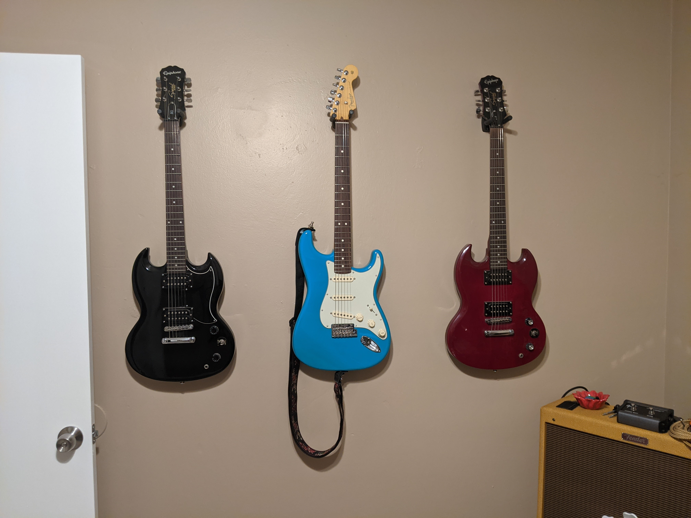

# MY NAME IS JOSEPH MIKHAIL
**I am a guitar fanatic and a car enthusiast.**

Below is a picture containing some of the guitars in my collection from almost two years ago. Unfortunately, I do not have the SG's on the right or left side anymore, but the guitar in the middle is my most prized possession. It's a Fender American Professional Stratocastor that costed me an arm and a leg. Needless to say it is my nicest guitar. My amplifier is pretty cool as well - you can see it on the bottom right of the photo.



My favorite guitar players! Can you tell I like stratocasters?
1. John Frusciante of the Red Hot Chili Peppers
2. John Mayer
3. Stevie Ray Vaughan (probably)
4. Eric Clapton (probably)
5. Jimi Hendrix

Here's an old video of a buddy and I covering a song. Good memories. I don't have the best voice, but I certainly try my best :)
> [Slow Dancing in a Burning Room by John Mayer](https://www.youtube.com/watch?v=Ik5fC3GvDvk)

## A bit of both passions!

I honestly love listening to all kinds of music in general and I love working on cars so I installed a subwoofer in my Toyota Corolla.
[This is a picture of my subwoofer.](/PXL_20210901_002922741.jpg) In fact, I love music so much that I stripped every bit of interior from my car and I put sound deadener everywhere! In the doors, on the floors, in the ceiling, and even in the trunk! [I'm a freak, right?!](/PXL_20220615_223608011.MP.jpg) I hope to one day utilize my knowledge of cars in the context of software engineering.

## Programmer Jo

All of the programming languages I have ever written a program with!
* Java
* Python
* C
* C++
* Assembly
* Does MATLAB count?
* Bash
* LaTeX

Life Goals:
- [ ] Work as a software engineer for the electric car industry
- [x] Be Happy
- [ ] Be Happy
- [ ] Be Happy
- [x] Be Happy
- [ ] Be Happy
- [ ] Be Happy

```
if (youWant())
    youCan();
else
    youWont();
```